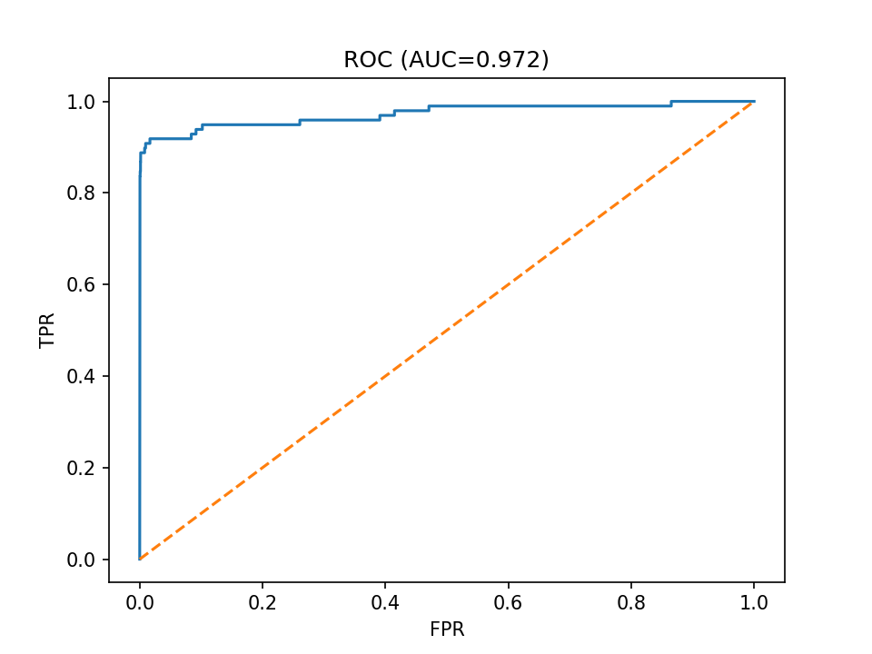
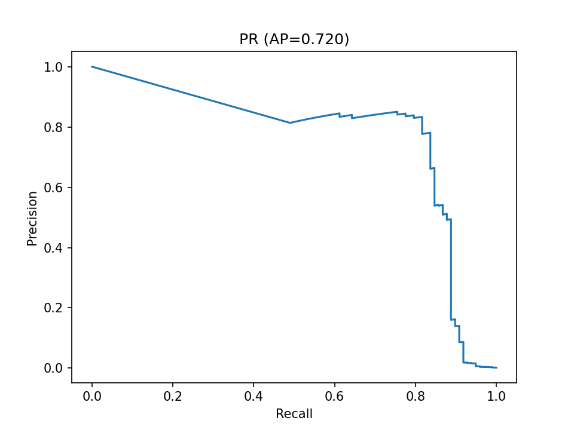

# Payment Fraud Monitoring Service

Модель бинарной классификации транзакций (фрод / не фрод).  
Сервис реализован как API (FastAPI) и CLI для пакетного скоринга.  
В проекте есть отчёты, метрики и графики.




---

## Цель проекта
Помочь финансовому сервису оперативно выявлять мошеннические транзакции.  
Фокус: минимизировать пропуск мошенничества (Recall), сохраняя приемлемый уровень ложных срабатываний.

---

## Решение
- Данные: анонимизированные транзакции (сумма, время, поведенческие признаки).  
- Предобработка: масштабирование числовых, балансировка классов (undersample).  
- Модель: RandomForestClassifier (устойчивость к несбалансированным данным).  
- Интерфейсы: API (`/predict_one`, `/predict_csv`) и CLI.  
- Конфиг: `config.yaml`.  

---

## Метрики (снимок)
| Метрика   | Значение |
|-----------|----------|
| ROC-AUC   | 0.972 |
| PR-AUC    | 0.720 |
| F1-score  | 0.114 |
| Recall    | 0.918 |
| Precision | 0.061 |
| Accuracy  | 0.976 |

📌 Интерпретация: модель ловит почти все фродовые транзакции (Recall≈0.92), но Precision низкий.  
Это соответствует задаче антифрода: лучше «перепроверить» честные транзакции, чем пропустить мошенничество.

---

## Быстрый старт

```
python -m venv .venv
.\.venv\Scripts ctivate
pip install -r requirements.txt
python -m uvicorn src.app:app --host 127.0.0.1 --port 8000 --reload
```

Swagger UI: http://127.0.0.1:8000/docs  
Healthcheck: http://127.0.0.1:8000/health  

Docker:
```
docker build -t payment-fraud-monitoring .
docker run -p 8000:8000 payment-fraud-monitoring
```

---

## Использование

Обучение:
```
python src/train.py --input data/creditcard.csv --output model/model.pkl
```

CLI:
```
python src/predict.py --config config.yaml --input data/new_tx.csv --output predictions.csv
```

API-запрос:
```
curl -X POST "http://127.0.0.1:8000/predict_one" -H "Content-Type: application/json" -d "{\"features\":{\"amount\":120.5,\"time_delta\":42.1,\"is_night\":1,\"country_mismatch\":0}}"
```

---

## Конфиг (config.yaml)
```
title: "Payment Fraud Monitoring"
model_path: "model/model.pkl"
target_col: "Class"
drop_cols: []
```

---

## Отчёты
```
python report/plots.py
python report/thresholds.py
```
Результаты:  
- report/metrics.md  
- report/roc_curve.png, report/pr_curve.png, report/prob_hist.png  
- report/thresholds.csv, report/precision_at_k.txt  

---

## Структура
```
payment_fraud_monitoring/
 ├── src/
 │   ├── train.py
 │   ├── predict.py
 │   └── app.py
 ├── report/
 ├── schemas/
 ├── config.yaml
 ├── DATA_PRIVACY.md
 ├── MODEL_CARD.md
 ├── requirements.txt
 └── README.md
```

---

## Приватность данных
Транзакционные данные не публикуются (NDA). Репозиторий содержит только код и отчёты.